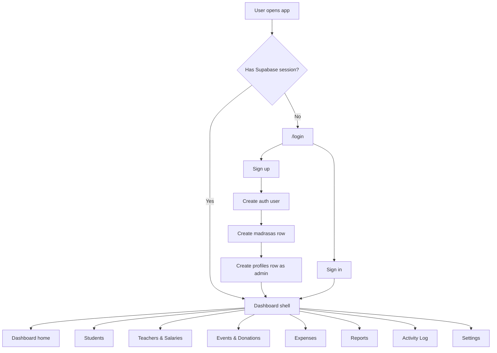
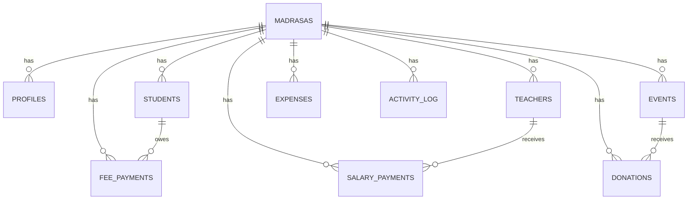

# Madrasa Manager: Current Project Workflow

This document describes the current implemented workflow of the project as it exists in the codebase today. It focuses on what is actually built, how the screens connect, which Supabase tables are involved, and which parts are complete versus only partially implemented.

## 1. Project Summary

This project is a `Next.js 16` App Router application for running a madrasa admin portal.

Its current responsibilities are:

- authenticating an admin/staff user with Supabase Auth
- creating a madrasa workspace during sign-up
- managing students and their fee records
- managing teachers and recording salary payments
- managing events and tracking donations
- tracking operational expenses
- generating a financial overview/report
- showing a shared activity log
- editing madrasa profile/settings

The app is primarily a client-rendered dashboard. Most business logic lives directly inside page components and talks to Supabase from the browser using the Supabase client SDK.

## 2. Tech Stack and Runtime Shape

### Frontend

- `Next.js` with the App Router
- `React 19`
- `Tailwind CSS v4`
- `lucide-react` for icons

### Backend/Data

- `Supabase Auth` for authentication
- `Supabase Postgres` tables accessed through `@supabase/supabase-js`
- `@supabase/ssr` for auth/session handling in middleware and server helpers

### Runtime pattern

- almost every page is a `"use client"` component
- pages fetch directly from Supabase in the browser
- there are no custom API routes for CRUD workflows
- there are no server actions for feature mutations
- the only server route in the app is the auth callback route

This means the application depends heavily on Supabase Row Level Security and table permissions being configured correctly outside this repository.

## 3. High-Level App Flow

## 4. Route Protection and Session Workflow

### Middleware behavior

The middleware checks the current Supabase session on every matched request.

- if the user is not authenticated and tries to access a protected route, they are redirected to `/login`
- `/login`, `/signup`, and `/auth/*` remain publicly reachable
- if an authenticated user tries to open `/login` or `/signup`, they are redirected to `/`

### Session helpers

There are two Supabase client factories:

- `src/lib/supabase/client.ts`: browser client for all client-side CRUD work
- `src/lib/supabase/server.ts`: server client used by the auth callback route

### Auth callback

`/auth/callback` exchanges a Supabase auth code for a session and then redirects to the requested next route or `/`.

## 5. Core Data Model

The project currently expects these main tables/entities:

- `madrasas`
- `profiles`
- `students`
- `teachers`
- `events`
- `donations`
- `expenses`
- `salary_payments`
- `fee_payments`
- `activity_log`

### Relationship overview

### Important modeling notes

- `profiles` links the authenticated user to a `madrasa_id`
- most create flows first read the current profile to find the active `madrasa_id`
- almost every record created in the dashboard is scoped to the current madrasa
- several screens do not explicitly filter by `madrasa_id` in the query, so tenant isolation appears to rely on Supabase policies rather than frontend filters

## 6. Authentication and Onboarding Workflow

The login page supports both sign-in and sign-up inside the same screen.

### Sign-in flow

1. User enters email and password.
2. The app calls `supabase.auth.signInWithPassword`.
3. On success it navigates to `/` and refreshes the router.

### Sign-up flow

1. User enters full name, madrasa name, email, and password.
2. The app creates a Supabase auth user.
3. It inserts a new row into `madrasas`.
4. It inserts a new row into `profiles` using the auth user id and the new madrasa id.
5. The new profile is always created with role `admin`.
6. The app redirects to `/`.

### Current limitation

The sign-up sequence is not transactional. If auth succeeds but madrasa/profile insertion fails, partial data can be left behind.

## 7. Dashboard Shell Workflow

Once authenticated, the user enters a shared dashboard layout.

### Shell structure

- root layout provides fonts, metadata, and the global toast provider
- dashboard layout renders the sidebar plus the active page
- sidebar handles:
  - desktop fixed navigation
  - mobile drawer navigation
  - logout using `supabase.auth.signOut()`

### Main navigation

- Dashboard
- Students
- Events & Donations
- Expenses
- Teachers & Salaries
- Reports
- Activity Log
- Settings

## 8. Dashboard Home Workflow

The dashboard home page is a summary screen built from multiple tables.

### Data load sequence

The page first fetches the current profile:

- `profiles`: `madrasa_id`, `full_name`

Then it fires parallel reads for:

- active students count from `students`
- all donations from `donations`
- all expenses from `expenses`
- all salary payments from `salary_payments`
- all fee payments from `fee_payments`
- next 3 upcoming events from `events`
- 3 most recent students from `students`

### Derived metrics

The page calculates:

- total students
- total income = donations + paid fees
- total expenses = expenses + salary payments
- net balance = total income - total expenses

### Dashboard outputs

- greeting using the first word of the current profile name
- four summary stat cards
- recent transaction table merged from donations, expenses, salaries, and fees
- upcoming events card
- recent student registrations card

## 9. Students Workflow

Student management is one of the most complete parts of the project.

### Students list page

The students page:

- loads all students ordered by `created_at desc`
- supports client-side search by student name or parent name
- supports client-side class filtering
- shows status, parent information, and quick actions

Available actions:

- view student profile
- edit student
- delete student

### Add student workflow

1. User opens `/students/new`.
2. User fills student details, guardian details, and address.
3. The page fetches `madrasa_id` from the current profile.
4. It inserts a new row into `students`.
5. It logs an activity entry in `activity_log` under category `students`.
6. It redirects back to `/students`.

### Student detail workflow

The student profile page loads:

- one student from `students`
- all fee records for that student from `fee_payments`

It then presents:

- profile header and active/inactive badge
- parent and student metadata
- outstanding balance
- last paid amount
- fee history table

### Fee management workflow

From the student detail page, the user can:

- add a fee record
- mark a pending fee as paid
- delete a fee record

#### Add fee

1. User opens the inline fee form.
2. The page fetches `madrasa_id` from `profiles`.
3. It inserts a new `fee_payments` row with:
   - `student_id`
   - `madrasa_id`
   - description
   - amount
   - status
   - fee date
4. It logs a `financial` activity entry.
5. It reloads the student and fee list.

#### Mark fee as paid

- updates `fee_payments.status` from `pending` to `paid`
- refreshes the screen

#### Delete fee

- deletes the selected `fee_payments` row
- refreshes the screen

### Edit student workflow

1. The edit page loads the current student row.
2. The user updates fields including `is_active`.
3. The app updates the `students` table row.
4. It logs a `students` activity entry.
5. It redirects back to the student detail page.

### Student workflow limitations

- deleting a student does not explicitly delete related fee records in the UI code
- marking a fee as paid does not create an activity log entry
- deleting a fee record does not create an activity log entry
- `joined_at` is displayed on the student profile, but it is never set in the add form

## 10. Teachers and Salaries Workflow

This section handles staff management and payroll recording.

### Teachers list workflow

The page loads all teachers ordered by name and shows:

- teacher name
- subject
- phone
- monthly salary

### Add teacher workflow

1. User opens the add teacher modal.
2. Form validation checks:
   - name is required
   - salary cannot be negative
3. The page loads `madrasa_id` from the current profile.
4. It inserts a row into `teachers`.
5. It logs an activity entry with category `teachers`.
6. It reloads the teacher list.

### Salary payment workflow

1. User clicks `Pay Salary` for a teacher.
2. A modal opens with amount, month, and year.
3. Validation checks:
   - amount must be positive
   - month is required
4. The page inserts a row into `salary_payments`.
5. It logs a `financial` activity entry.
6. The modal closes.

### Delete teacher workflow

1. User confirms deletion.
2. The code first deletes related `salary_payments` rows for that teacher.
3. Then it deletes the teacher row from `teachers`.
4. It logs a `teachers` activity entry.
5. It reloads the list.

### Teacher workflow limitations

- there is no teacher detail page
- there is no teacher edit workflow
- salary history is recorded but not displayed on the teachers page
- teacher status fields from the type definition are not managed in the UI

## 11. Events and Donations Workflow

This section tracks fundraising-style events and incoming donations.

### Events list workflow

The page:

1. loads all rows from `events`
2. loads all rows from `donations`
3. computes donation totals per event in memory
4. shows an events table and summary cards

Available outputs:

- searchable event list
- total donations per event
- total event count
- total donations across all events
- average donation amount per event

### Create event workflow

1. User opens the new event modal.
2. Validation checks:
   - title is required
   - event date is required
3. The page loads the current `madrasa_id`.
4. It inserts a new `events` row.
5. It logs an `events` activity entry.
6. It reloads the events list.

### Delete event workflow

1. User confirms deletion.
2. The code deletes related `donations` rows for that event.
3. Then it deletes the `events` row.
4. It logs an `events` activity entry.
5. It reloads the list.

### Event detail workflow

When the user opens a specific event page, the screen loads:

- the event row from `events`
- all donations for that event from `donations`

The page then displays:

- event metadata
- total donations collected
- donations table
- add donation modal trigger

### Add donation workflow

1. User opens the donation modal.
2. User enters donor name, amount, and optional notes.
3. The page loads the current `madrasa_id`.
4. It inserts a row into `donations`.
5. It logs a `financial` activity entry.
6. It reloads the event details.

### Event workflow limitations

- the event detail page has an actions icon for donations, but no implemented donation edit/delete actions
- there is no event edit workflow
- total donations are calculated on the client by loading all donations rather than through an aggregate query

## 12. Expenses Workflow

The expenses page manages outgoing operational spending.

### Expenses list workflow

The page:

- loads all expenses ordered by `expense_date desc`
- supports category filtering
- displays category, description, date, and amount

### Add expense workflow

1. User opens the add expense modal.
2. Validation checks:
   - category is required
   - amount must be positive
   - expense date is required
3. The page loads `madrasa_id` from `profiles`.
4. It inserts a row into `expenses`.
5. It logs a `financial` activity entry.
6. It reloads the expense list.

### Delete expense workflow

1. User confirms deletion.
2. The page deletes the selected expense row.
3. It logs a `financial` activity entry.
4. It reloads the list.

## 13. Reports Workflow

The reports page is a financial aggregation page rather than a separate reporting backend.

### Data sources

The page loads these four datasets in parallel:

- donations
- expenses
- salary payments
- paid fee payments only

### Derived outputs

From those datasets it computes:

- total revenue
- operational costs
- salaries
- fee income
- net profit
- a monthly income vs expense trend for the last 6 months
- a recent transactions list
- CSV export data

### Charts and summaries

The current page builds its own visualizations in plain JSX/CSS:

- income vs expense mini bar chart
- expense breakdown donut
- salary breakdown progress bars
- cumulative net balance chart

### Export workflow

The export button currently creates and downloads a CSV file assembled in the browser from the loaded datasets.

### Reports workflow limitations

- the button label says `Export PDF`, but the implementation exports `CSV`
- some displayed percentage changes like `+12%`, `+5%`, `+18%`, and `+2%` are hard-coded presentation values, not real computed growth metrics
- salary breakdown into teaching/support/admin percentages is also hard-coded
- the page only includes paid fee records, not pending receivables

## 14. Activity Log Workflow

The activity log page reads from `activity_log` and presents an audit-style table.

### How logs are written

Many mutation flows call `logActivity(...)`.

That helper:

1. gets the current auth user
2. looks up the user profile
3. inserts an `activity_log` row with:
   - `madrasa_id`
   - `user_name`
   - category
   - description
   - optional entity type
   - optional entity id

### How logs are read

The activity page:

- requests paginated logs from Supabase
- sorts by latest first
- supports server-side date range filtering
- supports client-side text filtering on the current loaded page

### Activity categories currently used

- `students`
- `teachers`
- `financial`
- `events`
- `settings`
- `system` is defined but not actively used in the current pages

### Activity workflow limitations

- text search only filters the current page of results after the fetch, not the whole log table
- the `Filter` button currently resets the date range instead of applying anything extra
- the row `Details` icon has no implemented detail view
- not every mutation in the app writes an activity record

## 15. Settings Workflow

The settings page edits the madrasa profile itself.

### Load flow

1. The page fetches the current `madrasa_id` from `profiles`.
2. It loads the corresponding row from `madrasas`.
3. It fills the form with name, phone, email, and address.

### Save flow

1. User edits the form.
2. The page validates that the madrasa name exists.
3. It updates the `madrasas` row.
4. It logs a `settings` activity entry.
5. It shows a success toast.

### Settings workflow limitation

The `Danger Zone` section is UI-only right now. The delete madrasa button does not perform any action.

## 16. Shared UX Patterns

These patterns are reused across the project:

- toast notifications for success/error feedback
- confirm dialog for destructive actions
- modal-based create flows for teachers, salaries, events, donations, and expenses
- page-based create/edit flows for students
- currency formatting uses `en-IN` locale and INR
- dates are consistently shown in `en-IN` formatting

## 17. What Is Fully Implemented vs Partially Implemented

### Implemented and working in the current code

- Supabase auth-based login
- self-serve sign-up with madrasa/profile creation
- route protection with middleware
- dashboard overview page
- student CRUD except explicit fee cascade handling on delete
- fee add/update/delete from student profile
- teacher create and delete
- salary payment recording
- event create, view, and delete
- donation add for an event
- expense create and delete
- financial report aggregations and CSV export
- madrasa settings update
- activity logging helper and activity viewer

### Present in UI but incomplete or not wired

- delete madrasa action
- donation action menu in event detail
- activity log details action
- truly server-side full-text activity search
- teacher edit/detail/history views
- event edit flow
- real PDF export

## 18. Architectural Observations

### Strengths of the current workflow

- simple and easy-to-follow CRUD flows
- consistent UI language across all sections
- clear entity separation: students, teachers, finance, events, settings
- activity logging already exists as a shared concept
- dashboard and reports reuse the same financial sources

### Current technical tradeoffs

- business logic is spread across page components instead of shared services
- almost all reads/writes happen client-side
- there is little transactional protection for multi-step workflows
- several pages use `any[]` rather than strong typing
- there are no automated tests in the repository
- there are no database schema/migration files in the repository

## 19. Non-Runtime Assets

The `stitch 2/` folder contains design/reference artifacts such as HTML mockups and screenshots for the major screens. These are not part of the live app runtime, but they appear to be the visual source material used to build the current UI.

## 20. Bottom Line

The project is currently a functional single-tenant-by-policy madrasa operations dashboard built on Next.js and Supabase. The main business workflows for student management, donations, expenses, teachers, salary recording, reporting, and settings are already implemented. The biggest gaps are around deeper auditability, edit/history views for some entities, true destructive account management, and a few UI elements that exist visually but are not yet connected to backend behavior.
